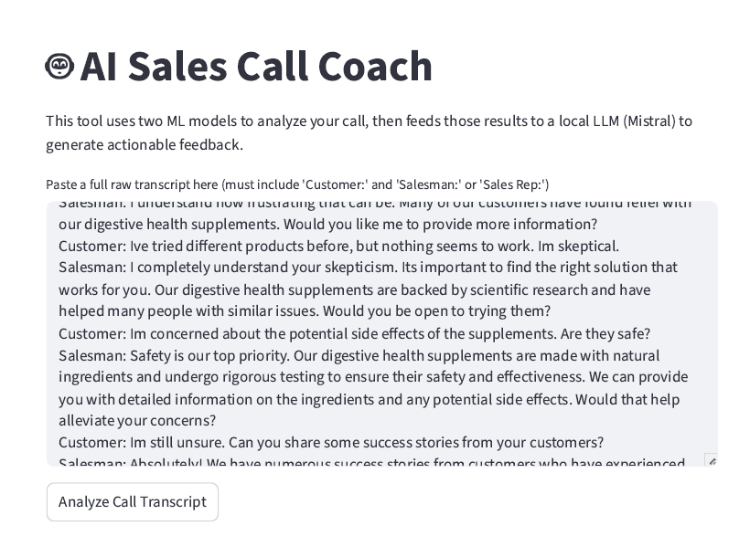
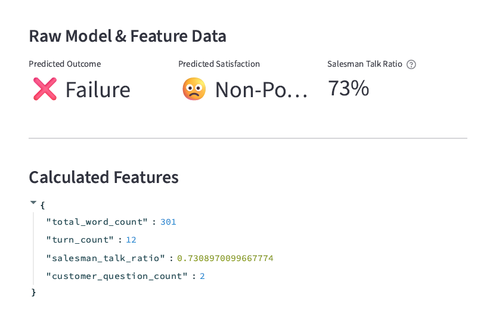
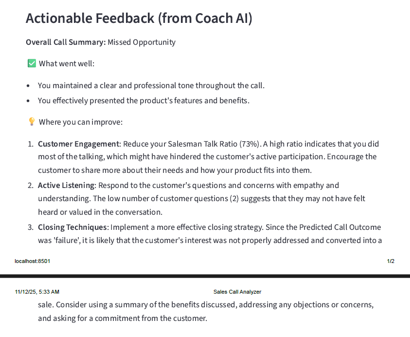

🤖 AI Sales Call Coach
This project is an AI-powered Streamlit web application that analyzes sales call transcripts. It uses a hybrid machine learning approach to predict the call outcome (success/failure) and customer satisfaction (Positive/Non-Positive).
The models' predictions and key call metrics are then fed to a local LLM (Ollama/Mistral) to generate dynamic, actionable feedback for the sales representative.

🚀 The Solution: A "Hybrid" AI Model
This project proves that a "hybrid" model is highly effective. Instead of relying only on complex deep learning, we combine two types of features:
"Expert" Custom Features: 4 hand-engineered features that capture the structure of the call (e.g., salesman_talk_ratio, turn_count).
"Meaning" Features (Embeddings): The 384-dimensional text embeddings from all-MiniLM-L6-v2 are compressed using PCA to a 30-feature "signal vector" that represents the meaning of the conversation.

These 34 features are then fed into two separate "specialist" models:
Outcome Model: A RandomForestClassifier (73% accuracy) that predicts success or failure.
Satisfaction Model: A RandomForestClassifier (70% accuracy) that predicts Positive or Non-Positive sentiment.
The final feedback is generated by sending these predictions and features to a Mistral LLM running via Ollama.
Feature Importance
The "expert" features were consistently ranked as the most important predictors, proving the success of this hybrid approach.

Top Features for outcome:
salesman_talk_ratio
PCA_1
PCA_2
total_word_count
Top Features for satisfaction:
salesman_talk_ratio
PCA_1
total_word_count
PCA_2

🖼️ Screenshots

📌 Home Interface

📌 Prediction Results

📌 AI Feedback Generated by Mistral LLM

📦 Installation & Setup

🔧 1. Clone the Repository
git clone https://github.com/y-ash-17/ai-sales-feedback-assistant

cd sales-feedback-ai

🔧 2. Install Dependencies

Create a virtual environment (recommended):

python -m venv venv
source venv/bin/activate

Install requirements:
pip install -r requirements.txt

🤖 3. Install and Start Ollama

Download Ollama from:
👉 https://ollama.com/download

Pull the Mistral model:
ollama pull mistral

Start Ollama (keep terminal open):
ollama run mistral

▶️ 4. Run the Streamlit App
streamlit run app/app.py

📝 Conclusion

This project demonstrates a complete ML + NLP + LLM pipeline for sales conversation analysis.
By combining traditional machine learning with modern generative AI, the system provides:
Accurate predictions
Personalized, human-like coaching
Full offline privacy
A clean, interactive UI
This makes it ideal for sales training, call center analytics, and performance coaching.
